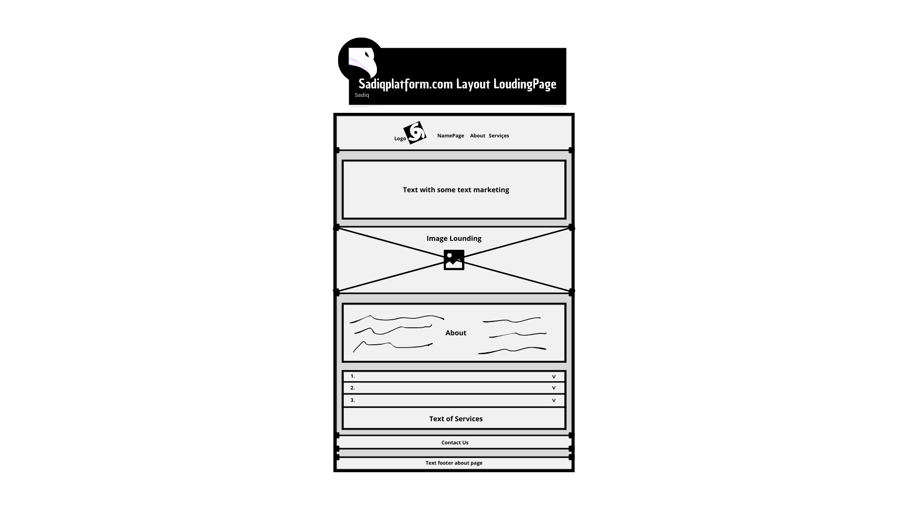

# V1

A primeira versão/V1 da sadiqplatform será iniciada apenas por uma Loading Page.

Determinamos que inicialmente o objetivo principal é informar todos os visitantes de o que será a sadiqplatform, fazendo assim uma unica pagina de consulta. Rápida e segura.&#x20;

O nosso conceito será sempre a base do projeto.&#x20;

Segurança e Lealdade.


[..](../)


***

## Layout

<figure><figcaption>
sadiqplatform.com V1 Layout.
</figcaption></figure>

### Cores

|                                 Código                                 |                   |
| :--------------------------------------------------------------------: | :---------------: |
| <pre class="language-css"><code class="lang-css">#000000
</code></pre> |     **Preto**     |
| <pre class="language-css"><code class="lang-css">#ffffff
</code></pre> |     **Branco**    |
| <pre class="language-css"><code class="lang-css">#424242
</code></pre> |    **Cinzento**   |
| <pre class="language-css"><code class="lang-css">#f5f5f5
</code></pre> | **Branco Fumado** |
| <pre class="language-css"><code class="lang-css">#f53ef5
</code></pre> |    **Violeta**    |

## Letra

|                                                           Fonte                                                          |
| :----------------------------------------------------------------------------------------------------------------------: |
| <pre class="language-css"><code class="lang-css">Impact, Haettenschweiler, 'Arial Narrow Bold', sans-serif
</code></pre> |

### Imagem Background

<figure><figcaption>
Imagem recolhida a partir da Inteligencia Artificial. 
</figcaption></figure>

***


